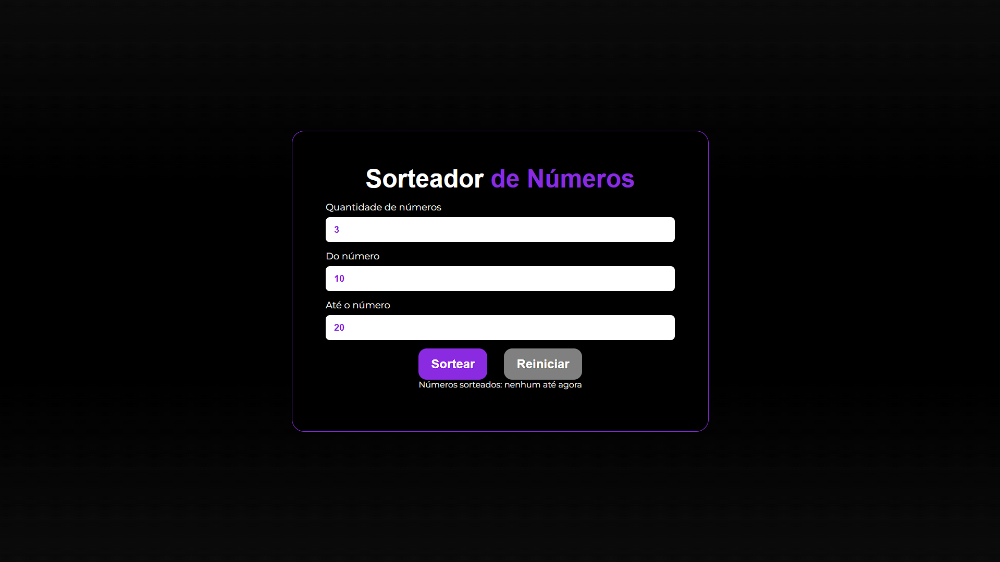
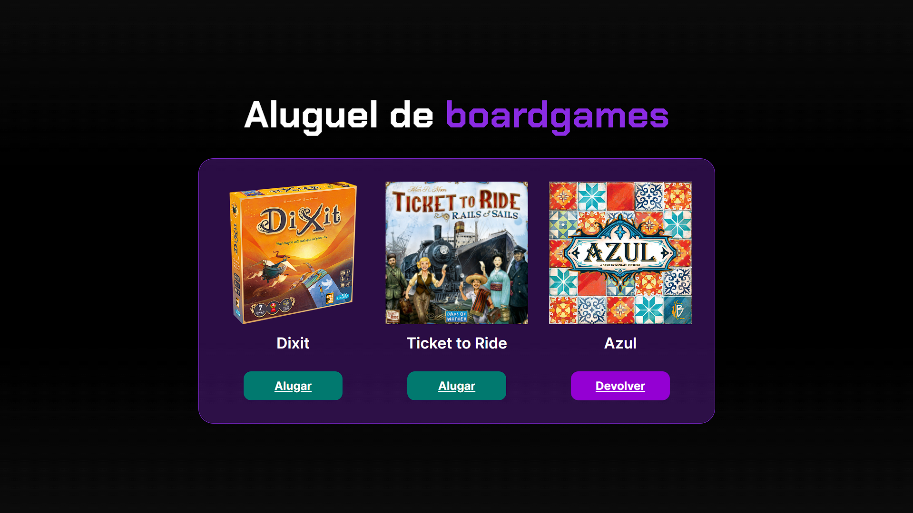
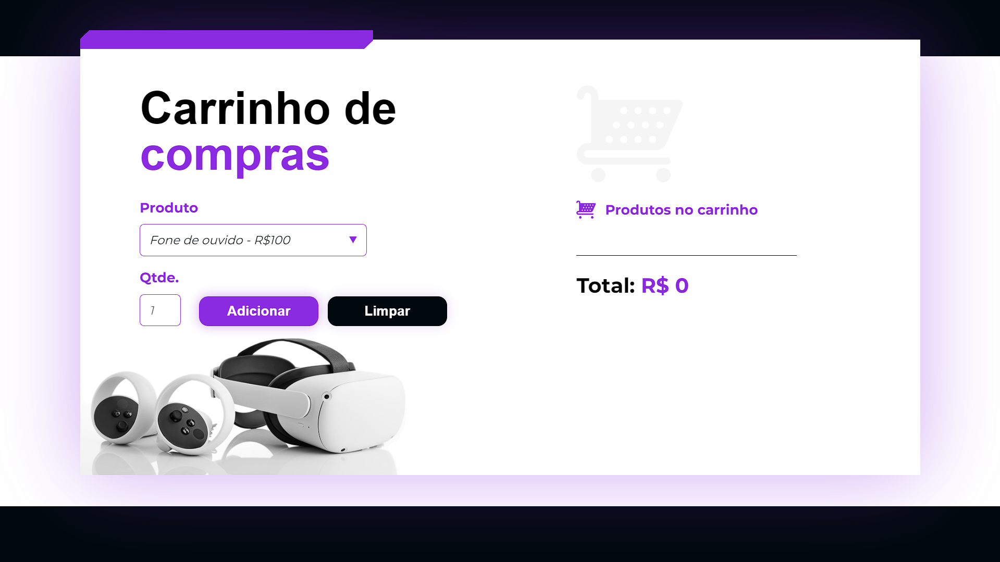
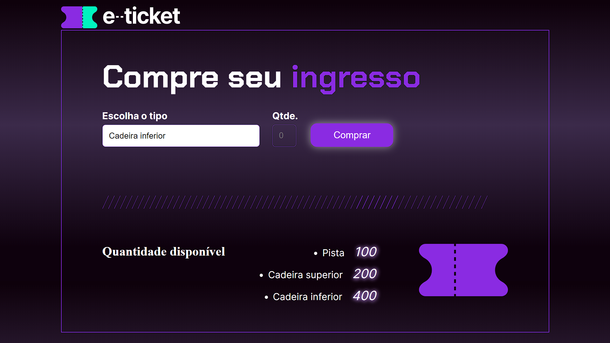
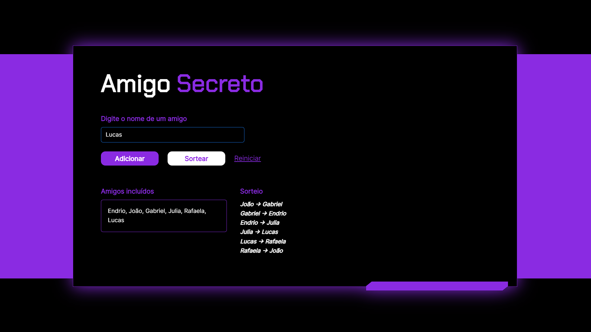

<h1>Desafios JavaScript</h1>

Este repositório contém minhas resoluções dos projetos em JavaScript realizados durante o curso da Alura <a href="https://cursos.alura.com.br/course/logica-programacao-praticando-desafios">"Lógica de programação: praticando com desafios"</a>. O curso foi disponibilizado pelo programa <a href="https://www.geracaocaldeira.org/">Geração Caldeira</a>, oferecido pelo <a href="https://institutocaldeira.org.br/">Instituto Caldeira</a>.

<h2>Tecnologias Utilizadas</h2>

    
    
    

<h2>Página inicial</h2>
<ul>
    <li>Página HTML com cinco botões centralizados, cada um direcionando para os projetos correspondentes.</li>
</ul>

<h1>Sorteador de Números</h1>

Este programa tem como objetivo gerar uma lista de números aleatórios dentro de um intervalo definido pelo usuário, sem repetir nenhum deles. Ele também fornece feedback ao usuário para verificar se o intervalo informado é válido antes de realizar o sorteio.

<h2>Funcionalidades</h2>
<ul>
    <li>🎲 Gerar números sorteados: O programa gera uma lista de números aleatórios dentro de um intervalo definido pelo usuário, sem repetir nenhum deles.</li>
    <li>🔍 Verificar quantidade de números: Antes de iniciar o sorteio, o programa verifica se a quantidade de números a ser sorteada é viável dentro do intervalo especificado pelo usuário.</li>
    <li>✔️ Validação de "de" e "até": Antes de iniciar o sorteio, o programa verifica se o número inicial (de) é menor que o número final (até) antes de realizar o sorteio.</li>
    <li>🔄 Reiniciar sorteio: Permite reiniciar o processo de sorteio após a geração dos números sorteados, limpando os campos e preparando para um novo sorteio.</li>
</ul>

<h2>Como executar</h2>
<ol>
    <li><a href="https://endrioalberton.github.io/DesafiosJavaScript/sortearNumeros/">Acesse o jogo</a>.</li>
    <li>Insira a quantidade de números que deseja sortear e defina os valores mínimo e máximo para o sorteio.</li>
    <li>Antes de iniciar o sorteio, o sistema verifica se todos os campos estão preenchidos corretamente: quantidade de números a serem sorteados, valor mínimo (De) e valor máximo (Até).</li>
</ol>

Exemplos de preenchimento correto:

    

<ol start="4">
    <li>Após preencher corretamente os campos, clique no botão "Sortear" para iniciar o processo de sorteio.</li>
    <li>Os números sorteados serão exibidos na tela assim que o sorteio for concluído.</li>
    <li>Para realizar um novo sorteio, clique em "Reiniciar". Isso limpará os campos e permitirá que você faça um novo sorteio.</li>
</ol>

<h1>Aluguel de Boardgames</h1>

Este projeto é um sistema de gerenciamento de aluguel de jogos, que visa permitir aos usuários visualizar e controlar o status de cada jogo disponível para aluguel. As funcionalidades são descritas abaixo, juntamente com instruções para usar o sistema:

<h2>Funcionalidades</h2>
<ul>
    <li>👀 Vizualizar jogos: O sistema permite ao usuário visualizar os jogos disponíveis e não disponíveis.</li>
    <li>🎮 Alugar jogos: O sistema permite ao usuário alugar ou devolver um jogo.</li>
</ul>

<h2>Como Executar</h2>
<ol>
    <li><a href="https://endrioalberton.github.io/DesafiosJavaScript/alugarJogos/">Acesse o site</a>.</li>
    <li>Clicando nos botões, você pode alugar ou devolver um jogo.</li>
    <li>O botão será alterado visualmente para indicar o status de aluguel do jogo.</li>
    <li>Um jogo alugado pode ser devolvido ao clicar no botão "Devolver".</li>
</ol>

Interface:

    

<h1>Carrinho de Compras</h1>

Este é um projeto de carrinho de compras simples. Ele permite adicionar produtos com quantidades variáveis e calcular o total da compra dinamicamente.

<h2>Funcionalidades</h2>
<ul>
    <li>🛒 Seleção de Produtos: Escolha entre diferentes produtos disponíveis para compra através de um menu dropdown.</li>
    <li>➕ Adição de Produtos: Adicione produtos ao carrinho especificando a quantidade desejada e clicando no botão "Adicionar".</li>
    <li>🧹 Limpeza do Carrinho: Limpe todos os produtos do carrinho clicando no botão "Limpar".</li>
    <li>🔄 Atualização Dinâmica: O total da compra e os produtos adicionados são atualizados dinamicamente na interface.</li>
</ul>

<h2>Como Executar</h2>
<ol>
    <li><a href="https://endrioalberton.github.io/DesafiosJavaScript/carrinhoCompras/">Acesse o site</a></li>
    <li>Escolha um produto no menu suspenso "Produto".</li>
    <li>Insira a quantidade desejada do produto no campo "Qtde.".</li>
    <li>Clique no botão "Adicionar" para incluir o produto no carrinho.</li>
    <li>Para remover todos os produtos do carrinho, clique no botão "Limpar".</li>
</ol>

Interface:

    

<h1>Comprar Ingresso</h1>

Este projeto é um sistema de compra de ingressos que permite aos usuários selecionar o tipo de ingresso e a quantidade desejada, verificar a disponibilidade e concluir a compra.

<h2>Funcionalidades</h2>
<ul>
    <li>🎟️ Seleção de Tipo de Ingresso: O usuário pode escolher entre ingressos de pista, cadeira superior ou cadeira inferior.</li>
    <li>➕ Verificação de Disponibilidade: O sistema verifica se a quantidade desejada de ingressos está disponível antes de concluir a compra.</li>
    <li>✔️ Confirmação de Compra: Se a quantidade de ingressos estiver disponível, o sistema reduz a quantidade disponível e confirma a compra.</li>
    <li>❌ Alerta de Indisponibilidade: Se a quantidade desejada de ingressos não estiver disponível, o sistema alerta o usuário.</li>
</ul>

<h2>Como Executar</h2>
<ol>
    <li><a href="https://endrioalberton.github.io/DesafiosJavaScript/ingresso/">Acesse o site</a>.</li>
    <li>Escolha o tipo de ingresso no menu suspenso "Tipo de Ingresso".</li>
    <li>Insira a quantidade desejada de ingressos no campo "Quantidade".</li>
    <li>Clique no botão "Comprar" para verificar a disponibilidade e concluir a compra.</li>
</ol>

Interface:

    

<h1>Amigo Secreto</h1>

Este projeto é um sistema de sorteio de Amigo Secreto que permite adicionar participantes, sortear pares e reiniciar o sorteio.

<h2>Funcionalidades</h2>
<ul>
    <li>➕ Adicionar Participantes: Permite adicionar nomes de participantes ao sorteio.</li>
    <li>🔄 Sortear Participantes: Realiza o sorteio dos participantes, formando pares de Amigo Secreto.</li>
    <li>🧹 Reiniciar Sorteio: Permite reiniciar o sorteio, limpando todos os participantes e resultados anteriores.</li>
</ul>

<h2>Como Executar</h2>
<ol>
    <li><a href="https://endrioalberton.github.io/DesafiosJavaScript/amigoSecreto/">Acesse o site</a>.</li>
    <li>Adicione os nomes dos participantes no campo de texto.</li>
    <li>Clique em "Adicionar" para incluir o participante na lista.</li>
<li>Após adicionar pelo menos 4 participantes, clique em "Sortear" para realizar o sorteio.</li>
<li>Os pares de Amigo Secreto serão exibidos na tela.</li>
<li>Para realizar um novo sorteio, clique em "Reiniciar". Isso limpará os campos e permitirá que você faça um novo sorteio.</li>
</ol>

Interface:

    

